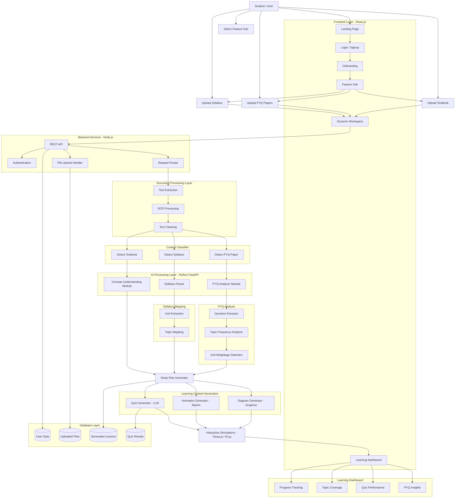

The AI Platform is a cutting-edge, web-based learning management system that revolutionizes educational experiences by integrating artificial intelligence with modern web technologies, built using Next.js 16.1.6, React 19.2.4, and TypeScript 5.7.3. It offers a personalized workspace with a centralized dashboard for analytics and progress tracking, alongside seven AI-enhanced learning modules—Concept, Study Plan, Syllabus, Quiz, PYQ, File Upload, and Simulation—that deliver structured content, adaptive assessments, personalized recommendations, and interactive simulations to cater to diverse educational needs. Key features include an AI Chat Panel for real-time assistance, a Recommendation Panel leveraging machine learning for content suggestions, and a Workflow Builder for creating custom, adaptive learning paths. Powered by a robust tech stack including Tailwind CSS, Radix UI, Zustand for state management, Axios for API handling, and Recharts for visualizations, the platform ensures a responsive, accessible interface with theme switching and seamless desktop-mobile adaptation, ultimately fostering improved educational outcomes through technology-driven, personalized learning experiences.

